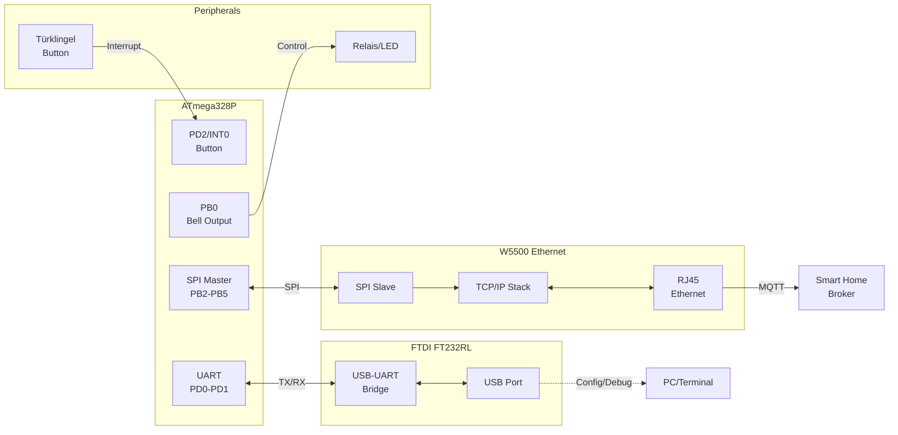
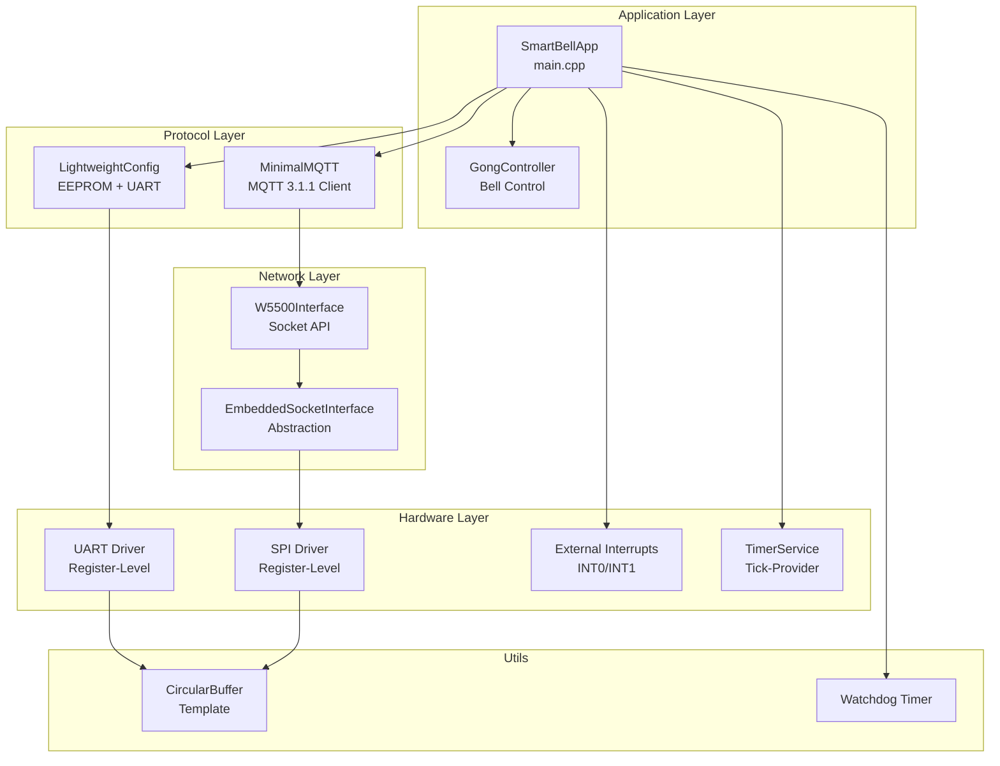
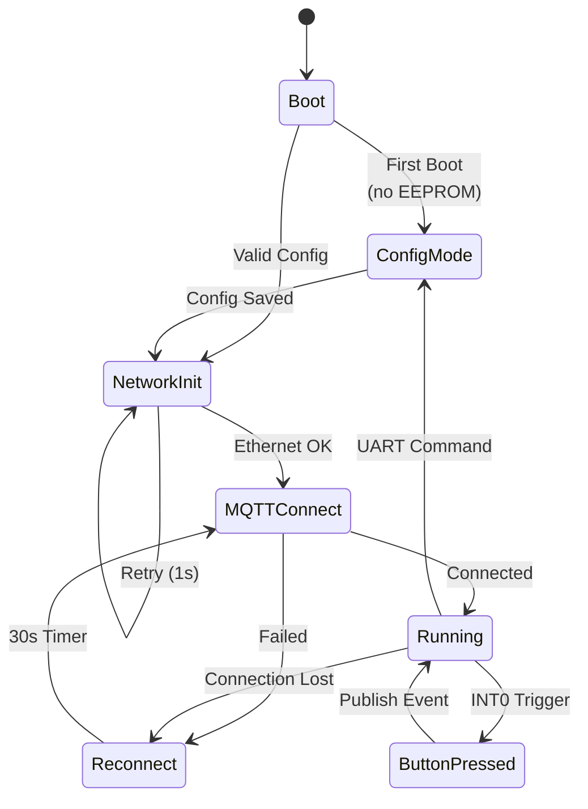
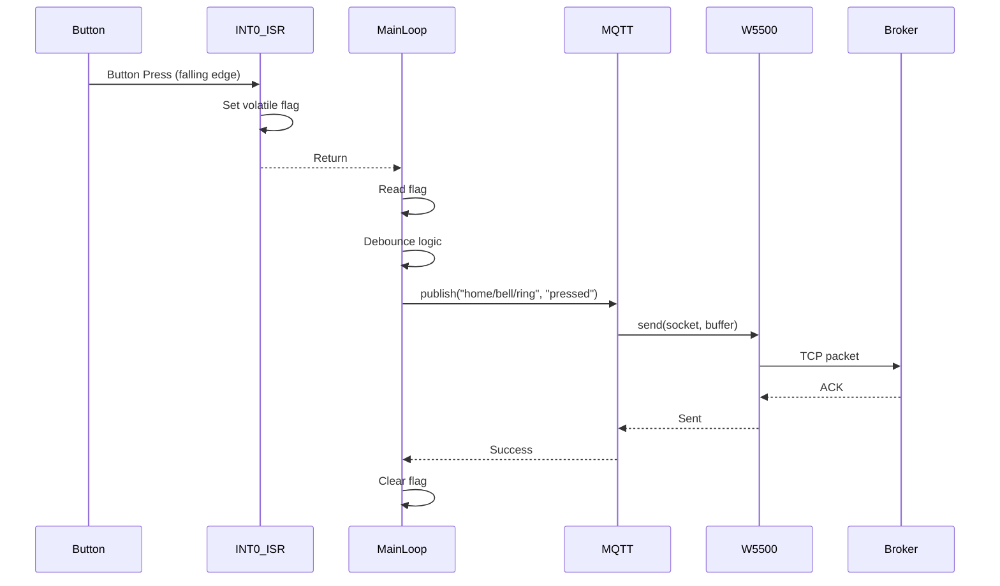
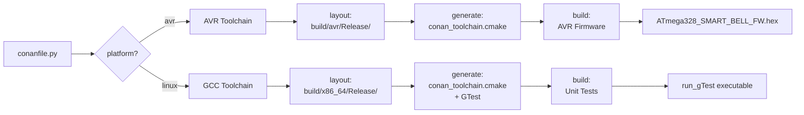
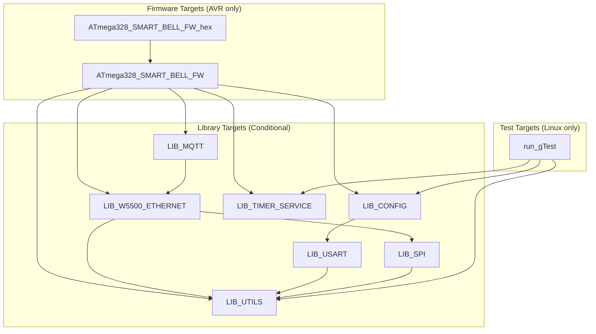
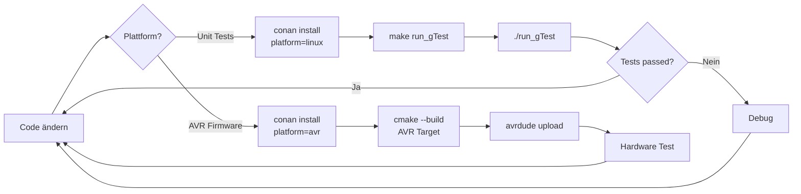

# Smart Bell - ATmega328P IoT Doorbell System


**Ein IoT-fähiges Türklingel-System mit MQTT-Anbindung basierend auf ATmega328P und W5500 Ethernet-Controller.**

---

## 📋 Inhaltsverzeichnis

- [Übersicht](#übersicht)
- [Features](#features)
- [Hardware Setup](#hardware-setup)
- [Software Architektur](#software-architektur)
- [Build-System (Conan)](#build-system-conan)
- [CMake Struktur](#cmake-struktur)
- [Libraries & Module](#libraries--module)
- [Konfiguration](#konfiguration)
- [Unit Tests](#unit-tests)
- [Memory Footprint](#memory-footprint)
- [Entwicklungs-Workflow](#entwicklungs-workflow)

---

## 🎯 Übersicht

Smart Bell ist eine bare-metal Firmware für den ATmega328P Mikrocontroller (bekannt vom Arduino UNO), die eine herkömmliche Türklingel in ein Smart-Home-fähiges IoT-Gerät verwandelt. Das System nutzt einen W5500 Ethernet-Controller für die Netzwerkkommunikation und kommuniziert über das MQTT-Protokoll mit einem Smart-Home-Server.

### Kernmerkmale

- **Bare-Metal C++**: Keine Arduino-Abstraktionen, direkte Register-Manipulation
- **Zero-Allocation**: Kein `malloc`/`new`, vollständig stack-basiert
- **Resource-Constrained**: Optimiert für 32 KB Flash / 2 KB SRAM
- **Hardware TCP/IP**: W5500 übernimmt kompletten Netzwerk-Stack
- **MQTT 3.1.1**: Minimale Implementation mit QoS 0
- **Unit-Testbar**: Plattform-unabhängige Logik mit GoogleTest auf Linux
- **Conan Build Interface**: Einheitliches Build-System für AVR und Linux

---

## ✨ Features

### Hardware Features

✅ **ATmega328P @ 16MHz**  
✅ **W5500 Ethernet Module** (AZ-Delivery, 10/100 Mbit, Hardware TCP/IP Stack)  
✅ **SPI Communication** (W5500 ↔ ATmega328P)  
✅ **External Interrupts** (INT0/INT1 für Taster)  
✅ **UART Debug/Config** (19200 baud via FTDI)  
✅ **EEPROM Configuration** (persistente Einstellungen)  
✅ **Watchdog Timer** (4s Timeout)  
✅ **PoE-kompatibel** (mit separatem PoE-Splitter, W5500 Board hat kein integriertes PoE)

### Software Features

✅ **MQTT Client** (Publish/Subscribe, Auto-Reconnect)  
✅ **Button Event Publishing** (auf Tastendruck)  
✅ **Remote Control** (Enable/Disable via MQTT)  
✅ **UART Configuration Interface** (interaktive Konfiguration)  
✅ **Persistent Settings** (EEPROM mit Magic-Number)  
✅ **Minimal Memory Footprint** (1459B SRAM / 2048B = 71.2%)  
✅ **GoogleTest Unit Tests** (Linux host testing)  
✅ **Template-based CircularBuffer** (ISR-safe)

---

## 🔌 Hardware Setup

### Komponenten

| Komponente | Beschreibung | Spezifikation |
|------------|--------------|---------------|
| **ATmega328P** | 8-bit AVR Mikrocontroller | 16 MHz, 32 KB Flash, 2 KB SRAM |
| **W5500 Board** | Ethernet Controller Module | AZ-Delivery W5500, 10/100 Mbit, Hardware TCP/IP, SPI |
| **FTDI FT232RL** | USB-zu-UART Adapter | 3.3V/5V Logic, 19200 baud |
| **Türklingel-Taster** | Externer Button | Active-Low, Pull-Up |
| **PoE Splitter** | Power over Ethernet (optional) | 802.3af/at, 5V/2A Output |
| **Optional: LED** | Status-Anzeige | - |

> **⚠️ Wichtig:** Das AZ-Delivery W5500 Board hat **keinen integrierten PoE-Support**. Der W5500-Chip ist nur ein Ethernet-Controller. Für PoE wird ein separater PoE-Splitter benötigt (siehe [PoE Setup](#poe-setup-optional)).

### Pin-Belegung

#### ATmega328P ↔ W5500 (SPI)

> **📌 AZ-Delivery W5500 Board:** Das Board hat standardmäßig Pin-Header (nicht angelötet). Die Pin-Beschriftung auf dem Board entspricht den Standard-W5500-Pins.

| ATmega328P Pin | W5500 Pin | Signal | Beschreibung |
|----------------|-----------|--------|--------------|
| **PB5** (D13) | SCLK | SCK | SPI Clock |
| **PB4** (D12) | MISO | MISO | Master In, Slave Out |
| **PB3** (D11) | MOSI | MOSI | Master Out, Slave In |
| **PB2** (D10) | SCS | CS | Chip Select (active LOW) |
| **PD4** (D4) | RSTn | Reset | Hardware Reset (active LOW) |
| **3.3V** | VCC | Power | ⚠️ **W5500 Board läuft mit 3.3V!** |
| **GND** | GND | Ground | Common Ground |

> ⚠️ **Wichtig:** Der W5500-Chip arbeitet mit **3.3V Logik**. Der ATmega328P läuft mit 5V. Verwende:
> - **Option 1:** 3.3V Spannungsregler für W5500 + Level-Shifter für SPI-Signale
> - **Option 2:** Widerstands-Spannungsteiler (5V → 3.3V) für MOSI/SCK/CS Leitungen
> - Das AZ-Delivery Board hat bereits einen **3.3V Spannungsregler** onboard (versorge VCC mit 5V)
> - MISO ist unkritisch (3.3V wird vom ATmega als HIGH erkannt)

#### ATmega328P ↔ FTDI (UART)

| ATmega328P Pin | FTDI Pin | Signal | Beschreibung |
|----------------|----------|--------|--------------|
| **PD0** (RX/D0) | TX | RX | ATmega empfängt von FTDI |
| **PD1** (TX/D1) | RX | TX | ATmega sendet zu FTDI |
| **GND** | GND | Ground | Common Ground |
| **VCC** (optional) | VCC | Power | ⚠️ **Nur wenn FTDI als Stromquelle** |

> **Hinweis:** TX des ATmega328P wird mit RX des FTDI verbunden und umgekehrt.  
> **Spannung:** FTDI muss auf 5V-Logik konfiguriert sein (Jumper auf 5V) oder Level-Shifter verwenden.

#### Application Pins

Das System erwartet die Taster (Active-Low, gegen GND schaltend) und die Gong-Ausgänge (Active-High Steuersignale) an folgenden Ports:

### Inputs (Taster)
Die Taster sollten zwischen dem entsprechenden Pin und GND verbunden werden. Die internen Pull-up-Widerstände werden per Software aktiviert.

| Funktion | ATmega328P Pin | Port |
| :--- | :--- | :--- |
| **Taster Front** | PD2 | `PORTD2` |
| **Taster Intern** | PD3 | `PORTD3` |

### Outputs (Gong-Ansteuerung)
Die Ausgänge liefern ein HIGH-Signal (5V), um z.B. einen Optokoppler oder ein Relais für den Gong zu schalten.

| Funktion | ATmega328P Pin | Port |
| :--- | :--- | :--- |
| **Gong Front** | PB0 | `PORTB0` |
| **Gong Intern** | PB1 | `PORTB1` |

*(Hinweis: Achte bei der Ansteuerung von Relais unbedingt auf eine Freilaufdiode, um den ATmega vor Spannungsspitzen zu schützen!)*


#### Türklingel-Taster an PORTD2

Der Taster wird mit Hardware-Entprellung an PD2/INT0 angeschlossen:

**Schaltung:**
```
                    +5V
                     │
                     ├─────┐
                     │     │
                 10kΩ│     │100nF
              (Pull-Up)    │(Entprellung)
                     │     │
         ┌───────────┼─────┴─────────┐
         │           │               │
    PD2/INT0 ────────┤               │
         │           │               │
         └───────────┴───┐      ┌────┴─────┐
                         │      │          │
                      [Taster]  ═  100nF   │
                         │      │          │
                        GND    GND        GND
```

**Bauteile:**
- **R1: 10kΩ Pull-Up Widerstand** (optional - Firmware aktiviert internen Pull-Up)
- **C1: 100nF (0.1µF) Keramikkondensator** - Entprellung parallel zum Taster
- **Taster:** Schließer (Normally Open), verbindet PD2 mit GND beim Drücken

> 💡 **Software-Konfiguration:** Die Firmware aktiviert automatisch den **internen Pull-Up** (~20-50kΩ) für PD2. Ein externer 10kΩ Pull-Up ist optional und bietet stabilere Pegel bei langen Leitungen oder elektrisch gestörter Umgebung.

**Alternative (nur Software-Entprellung):**
```
                    +5V
                     │
                 10kΩ│ (Pull-Up)
                     │
         PD2/INT0 ───┤
                     │
                  [Taster]
                     │
                    GND
```
> **Hinweis:** Der ATmega328P hat interne Pull-Ups (~20-50kΩ), die per Software aktiviert werden können. Externe 10kΩ Pull-Ups sind stabiler.

**Kondensator-Dimensionierung:**
- **100nF (empfohlen):** Gute Entprellung für mechanische Taster, Entprellzeit ~1ms
- **47nF:** Für schnellere Reaktion, weniger Entprellung
- **220nF:** Stärkere Entprellung bei sehr prellenden Tastern
- **Typ:** Keramik-Kondensator (X7R oder C0G), 50V Spannungsfestigkeit

#### Status-LED an PORTB0

Die LED wird mit Vorwiderstand an PB0 angeschlossen:

**Schaltung:**
```
         PB0/D8 ───┬───[ 330Ω ]───┬───[LED]───┬─── GND
                   │              │     │>    │
                   │              │           │
                   └──────────────┴───────────┘
```

**Bauteile:**
- **R_LED: 330Ω Widerstand** (1/4W) - Vorwiderstand für Standard-LED
- **LED:** 5mm Standard-LED (rot, grün, etc.), 20mA Nennstrom

**Vorwiderstand berechnen:**
```
R = (Vcc - V_LED) / I_LED

Für rote LED (V_LED ≈ 2.0V, I_LED = 20mA):
R = (5V - 2.0V) / 0.020A = 150Ω (minimum)

Sichere Werte:
- 220Ω → 13.6mA (sehr hell)
- 330Ω → 9.1mA  (hell, empfohlen)
- 470Ω → 6.4mA  (gedimmt)
- 1kΩ  → 3.0mA  (schwach)
```

**LED-Farbabhängige Spannungen:**
| LED-Farbe | Vorwärtsspannung (V_LED) | Empfohlener Widerstand |
|-----------|---------------------------|------------------------|
| Rot | 1.8 - 2.2V | 220Ω - 330Ω |
| Grün | 2.0 - 2.5V | 220Ω - 330Ω |
| Blau | 3.0 - 3.5V | 100Ω - 220Ω |
| Weiß | 3.0 - 3.6V | 100Ω - 220Ω |
| Gelb | 2.0 - 2.4V | 220Ω - 330Ω |

**Strombelastbarkeit PB0:**
- ATmega328P Pin: max. 40mA (absolutes Maximum)
- Empfohlen: 10-20mA für LED
- Bei 330Ω: ~9mA (sicher im Dauerbetrieb)

> ⚠️ **Wichtig:** LED-Polarität beachten! Anode (+, längeres Bein) zu PB0, Kathode (-, kürzeres Bein) zu GND (über Widerstand).

### Hardware-Diagramm



### FTDI-Verbindung für Konfiguration/Debug

Der FTDI FT232RL Adapter ermöglicht die UART-Kommunikation zwischen dem ATmega328P und einem PC:

**Anschlussbelegung:**
```
ATmega328P          FTDI FT232RL
-----------         ------------
PD0 (RX) ---------> TX (Orange)
PD1 (TX) <--------- RX (Gelb)
GND ---------------> GND (Schwarz)
                     VCC (Rot) - nicht verbinden wenn externe Stromversorgung!
```

**FTDI-Einstellungen:**
- **Baud Rate:** 19200
- **Data Bits:** 8
- **Parity:** None
- **Stop Bits:** 1
- **Flow Control:** None
- **Jumper:** 5V-Logik (wenn ATmega mit 5V läuft)

**USB-Treiber:**
- Linux: `ftdi_sio` (meist automatisch geladen)
- Windows: [FTDI VCP Treiber](https://ftdichip.com/drivers/vcp-drivers/)
- macOS: Eingebauter Treiber (ab 10.9+)

### PoE Setup (Optional)

**⚠️ Das AZ-Delivery W5500 Board hat KEIN integriertes PoE!**

Das W5500-Modul ist nur ein Ethernet-Controller ohne Power-over-Ethernet-Funktionalität. Für PoE-Betrieb benötigst du einen **separaten PoE-Splitter**, der die Spannung aus dem Ethernet-Kabel extrahiert und in 5V für den ATmega328P umwandelt.

#### PoE-Verkabelung:

```
PoE Switch/Injector
      │
      │ Ethernet Kabel (RJ45)
      │ (Daten + Power 48V)
      ▼
  ┌─────────────────┐
  │  PoE Splitter   │
  │  (802.3af/at)   │
  └─────────────────┘
      │       │
      │       └──► 5V/GND ──► ATmega328P VIN/GND
      │
      └──► Ethernet (nur Daten) ──► W5500 RJ45
```

**Empfohlene PoE Splitter:**
- **Standard PoE (802.3af/at):** z.B. TP-Link TL-PoE10R, Netgear GS105PE
  - Input: 48V DC (aus PoE Switch)
  - Output: 5V DC / 2A (für ATmega328P)
  - Vorteil: Standardkonform, sicher
  
- **Passive PoE:** z.B. Ubiquiti POE-48-24W
  - Günstiger, aber nicht standardkonform
  - Nur mit passendem Injector verwenden
  - ⚠️ Falsche Spannung kann Geräte zerstören

**Anschluss:**
1. PoE-Splitter Output (5V) → ATmega328P `VIN` Pin
2. PoE-Splitter GND → ATmega328P `GND` Pin
3. PoE-Splitter Ethernet Out → W5500 RJ45 Buchse
4. PoE Switch → PoE-Splitter Input (über Standard-Ethernet-Kabel)

**Alternative Stromversorgung (ohne PoE):**
- USB-Netzteil (5V/1A) über FTDI oder separaten USB-Anschluss
- Externes 5V DC-Netzteil an VIN/GND

---

## 🏗️ Software Architektur

### Design-Prinzipien

**1. Deterministische Ausführung**
```
Interrupt → Flag setzen → Main-Loop → MQTT → UART
```

**2. Zero-Overhead C++**
- ❌ VERBOTEN: `malloc`, `new`, `delete`, exceptions, RTTI
- ✅ ERLAUBT: `constexpr`, `std::array`, `PROGMEM`, stack allocation

**3. ISR-Safety**
- ISRs setzen nur `volatile` Flags
- Main-Loop verarbeitet alle Netzwerk-Operationen
- `ATOMIC_BLOCK()` für 16-bit Zugriffe

**4. Hardware Abstraction Layers**
- Testbare Logik (Linux) ↔ Hardware-Layer (AVR)
- `serial::Interface` für UART Mocking
- `EEPROMMock` für EEPROM Simulation

### Module-Übersicht



### State Machine



### Datenfluss



---

## 🔧 Build-System (Conan)

### Conan als primäres Build-Interface

Conan ist das **zentrale Build-Interface** für dieses Projekt. Es verwaltet:
- Plattform-spezifische Builds (AVR vs. Linux)
- Dependencies (GoogleTest für Tests)
- CMake Presets und Toolchains
- Build-Ordner-Struktur

### Conan Options

```python
options = {
    "platform": ["avr", "linux"],  # Ziel-Plattform
    "tests": [True, False]         # Unit Tests aktivieren
}
```

### Build-Befehle

#### 1️⃣ AVR Firmware bauen

```bash
# AVR Release Build (Production)
conan install . --build=missing \
    -pr:h=avr-mega328p \
    -o platform=avr \
    -o tests=False

source build/avr/Release/generators/conanbuild.sh
cmake --preset conan-generated-avr-release
cmake --build build/avr/Release --target ATmega328_SMART_BELL_FW_hex

# Output: build/avr/Release/app/ATmega328_SMART_BELL_FW.hex
```

#### 2️⃣ Linux Unit Tests bauen

```bash
# Linux Test Build
conan install . --build=missing \
    -pr:h=default \
    -o platform=linux \
    -o tests=True

cd build/x86_64/Release
cmake -G "Unix Makefiles" \
    -DCMAKE_TOOLCHAIN_FILE=generators/conan_toolchain.cmake \
    -DCMAKE_BUILD_TYPE=Release \
    ../../..

make run_gTest -j$(nproc)
./tests/run_gTest

# Oder mit Shortcut-Script:
./build_and_test.sh
```

#### 3️⃣ AVR Debug Build (mit Symbolen)

```bash
conan install . --build=missing \
    -pr:h=avr-mega328p_g \
    -o platform=avr \
    -o tests=False

source build/avr/Debug/generators/conanbuild.sh
cmake --preset conan-generated-avr-debug
cmake --build build/avr/Debug --target ATmega328_SMART_BELL_FW_hex
```

### Conan Build-Flow



### Conan Profile Anforderungen

Die Conan Profiles müssen in `~/.conan2/profiles/` liegen:

**avr-mega328p** (Release):
```ini
[settings]
arch=avr
compiler=gcc
compiler.version=7
build_type=Release

[buildenv]
PATH=/opt/avr8-gnu-toolchain-linux_x86_64/bin:$PATH
CC=avr-gcc
CXX=avr-g++
AR=avr-ar
AS=avr-as
NM=avr-nm
OBJCOPY=avr-objcopy
OBJDUMP=avr-objdump
RANLIB=avr-ranlib
STRIP=avr-strip
```

**avr-mega328p_g** (Debug):
```ini
[settings]
arch=avr
compiler=gcc
compiler.version=7
build_type=Debug

[buildenv]
PATH=/opt/avr8-gnu-toolchain-linux_x86_64/bin:$PATH
CC=avr-gcc
CXX=avr-g++
# ... (rest wie oben)
```

---

## 📁 CMake Struktur

### Ordner-Hierarchie

```
smart-bell/
├── CMakeLists.txt              # Root CMake (platform guards)
├── conanfile.py                # Conan build interface
├── app/
│   ├── CMakeLists.txt
│   ├── main.cpp                # Main firmware (SmartBellApp)
│   └── uart_example.cpp        # Example app
├── src/
│   ├── CMakeLists.txt          # Conditional subdirs
│   ├── Serial/
│   │   ├── CMakeLists.txt      # LIB_USART, LIB_SPI
│   │   ├── UART.cpp
│   │   └── SPI.cpp
│   ├── Ethernet/
│   │   ├── CMakeLists.txt      # LIB_W5500_ETHERNET
│   │   └── W5500/
│   ├── MQTT/
│   │   ├── CMakeLists.txt      # LIB_MQTT (INTERFACE for tests)
│   │   └── MinimalMQTT.cpp
│   ├── Config/
│   │   ├── CMakeLists.txt      # LIB_CONFIG (conditional sources)
│   │   ├── LightweightConfig.cpp
│   │   └── ConfigManager.cpp
│   ├── System/
│   │   ├── CMakeLists.txt      # LIB_TIMER_SERVICE
│   │   └── TimerService.cpp
│   └── Utils/
│       ├── CMakeLists.txt      # LIB_UTILS
│       └── CircularBuffer.cpp
├── tests/
│   ├── CMakeLists.txt          # run_gTest target
│   ├── Mocks/
│   │   └── AVRHardwareMock.h   # EEPROM + Register Mocks
│   ├── Config/
│   │   └── LightweightConfig_test.cpp
│   └── Utils/
│       └── CircularBuffer_test.cpp
├── public/                     # Header files
│   ├── Serial/
│   │   ├── Interface.h         # Abstract UART interface
│   │   ├── UART.h
│   │   └── SPI.h
│   ├── MQTT/
│   │   └── MinimalMQTT.h
│   ├── Config/
│   │   └── LightweightConfig.h
│   └── Utils/
│       └── CircularBuffer.h    # Template header-only
└── build/
    ├── avr/Release/            # AVR firmware builds
    └── x86_64/Release/         # Linux test builds
```

### CMake Targets



### CMake Conditional Compilation

**Root CMakeLists.txt:**
```cmake
# Platform guards für AVR-specific code
if(NOT ${ENABLE_UNIT_TESTS})
    # Nur für AVR:
    add_custom_target(install_target ...)
    add_custom_command(ATmega328_SMART_BELL_FW_hex ...)
endif()
```

**src/CMakeLists.txt:**
```cmake
# Immer:
add_subdirectory(Utils)
add_subdirectory(System)
add_subdirectory(Config)
add_subdirectory(MQTT)

# Nur für AVR:
if(NOT ENABLE_UNIT_TESTS)
    add_subdirectory(Serial)
    add_subdirectory(Ethernet)
    add_subdirectory(Network)
    add_subdirectory(App)
endif()
```

**src/Config/CMakeLists.txt:**
```cmake
if(ENABLE_UNIT_TESTS)
    # Tests: nur platform-independent code
    add_library(${LIB_CONFIG} STATIC
        ${CMAKE_CURRENT_SOURCE_DIR}/LightweightConfig.cpp
    )
else()
    # AVR: full implementation
    add_library(${LIB_CONFIG} STATIC
        ${CMAKE_CURRENT_SOURCE_DIR}/LightweightConfig.cpp
        ${CMAKE_CURRENT_SOURCE_DIR}/ConfigManager.cpp
    )
    target_link_libraries(${LIB_CONFIG} PUBLIC ${LIB_USART})
endif()
```

**src/MQTT/CMakeLists.txt:**
```cmake
if(ENABLE_UNIT_TESTS)
    # Tests: INTERFACE library (kein W5500 Code)
    add_library(${LIB_MQTT} INTERFACE)
else()
    # AVR: full MQTT implementation
    add_library(${LIB_MQTT} STATIC
        ${CMAKE_CURRENT_SOURCE_DIR}/MinimalMQTT.cpp
    )
    target_link_libraries(${LIB_MQTT} PUBLIC 
        ${LIB_W5500_ETHERNET}
        ${LIB_USART}
        ${LIB_TIMER_SERVICE}
    )
endif()
```

---

## 📚 Libraries & Module

### 1. Serial Communication

#### `Serial::UART` (LIB_USART)
**Pfad:** `public/Serial/UART.h`, `src/Serial/UART.cpp`

**Features:**
- 19200 baud, 8N1
- Register-level ATmega328P UART
- ISR-safe mit `CircularBuffer<32>`
- Implements `serial::Interface`

**API:**
```cpp
namespace serial {
class UART : public Interface {
public:
    static UART& instance();
    void init(uint32_t baudrate);
    
    // Interface implementation
    void send(uint8_t byte) override;
    void send_string(const char* str) override;
    bool read_byte(uint8_t& byte) override;
    
private:
    CircularBuffer<32> tx_buffer_;
    CircularBuffer<32> rx_buffer_;
};
}

// Usage:
serial::UART::instance().init(19200);
serial::UART::instance().send_string("Hello\n");
```

**ISR Handler:**
```cpp
ISR(USART_RX_vect) {
    uint8_t data = UDR0;
    serial::UART::instance().rx_buffer_.push_back(data);
}

ISR(USART_UDRE_vect) {
    uint8_t data;
    if (serial::UART::instance().tx_buffer_.pop_front(data)) {
        UDR0 = data;
    } else {
        UCSR0B &= ~(1 << UDRIE0); // Disable TX interrupt
    }
}
```

#### `Serial::SPI` (LIB_SPI)
**Pfad:** `public/Serial/SPI.h`, `src/Serial/SPI.cpp`

**Features:**
- SPI Mode 0 (CPOL=0, CPHA=0)
- 4 MHz Clock (F_CPU/4)
- Hardware CS control
- ISR-safe mit `CircularBuffer<16>`

**API:**
```cpp
namespace serial {
class SPI {
public:
    static SPI& instance();
    void init();
    void select();   // CS LOW
    void deselect(); // CS HIGH
    uint8_t transfer(uint8_t data);
    
private:
    CircularBuffer<16> buffer_;
};
}

// Usage:
serial::SPI::instance().init();
serial::SPI::instance().select();
uint8_t response = serial::SPI::instance().transfer(0xAA);
serial::SPI::instance().deselect();
```

### 2. Ethernet Layer

#### `W5500Interface` (LIB_W5500_ETHERNET)
**Pfad:** `public/Ethernet/W5500/W5500Interface.h`, `src/Ethernet/W5500/W5500Interface.cpp`

**Features:**
- W5500 Register-Access via SPI
- Socket Management (8 Sockets)
- Hardware TCP/IP Stack
- MAC/IP Configuration

**API:**
```cpp
class W5500Interface {
public:
    static W5500Interface& instance();
    
    void init();
    void reset();
    void setMAC(const uint8_t* mac);
    void setIP(const uint8_t* ip);
    void setSubnet(const uint8_t* subnet);
    void setGateway(const uint8_t* gateway);
    
    // Socket operations (uses WIZnet ioLibrary)
    int8_t socket(uint8_t sn, uint8_t protocol, uint16_t port);
    int32_t send(uint8_t sn, const uint8_t* buf, uint16_t len);
    int32_t recv(uint8_t sn, uint8_t* buf, uint16_t len);
    void disconnect(uint8_t sn);
    uint8_t getSn_SR(uint8_t sn); // Socket status
};

// Usage:
W5500Interface::instance().init();
uint8_t mac[6] = {0xDE, 0xAD, 0xBE, 0xEF, 0xFE, 0xED};
W5500Interface::instance().setMAC(mac);
```

#### `EmbeddedSocketInterface`
**Pfad:** `public/Ethernet/EmbeddedSocketInterface.h`

**Features:**
- Abstract socket interface
- Bridge zu WIZnet ioLibrary
- Platform-agnostic API

### 3. MQTT Layer

#### `MinimalMQTT` (LIB_MQTT)
**Pfad:** `public/MQTT/MinimalMQTT.h`, `src/MQTT/MinimalMQTT.cpp`

**Features:**
- MQTT 3.1.1 Protocol
- QoS 0 (Fire-and-Forget)
- Username/Password Auth
- Auto-Reconnect (30s)
- Keepalive mit PINGREQ/PINGRESP
- Max. 1 Subscription
- 64B Send/Recv Buffers

**API:**
```cpp
class MinimalMQTT {
public:
    MinimalMQTT(const char* client_id, 
                const char* broker_ip, 
                uint16_t broker_port);
    
    bool connect(const char* username = nullptr, 
                 const char* password = nullptr);
    void disconnect();
    bool publish(const char* topic, const char* payload);
    bool subscribe(const char* topic);
    void loop(); // Call in main loop!
    
    bool is_connected() const;
    uint32_t last_activity() const;
};

// Usage:
MinimalMQTT mqtt("smartbell", "192.168.1.100", 1883);
mqtt.connect("user", "pass");

while (true) {
    mqtt.loop(); // Process network
    
    if (button_pressed) {
        mqtt.publish("home/bell/ring", "pressed");
    }
}
```

**Memory Footprint:**
- Stack: ~200B (buffers in-function)
- Flash: ~2.5 KB
- SRAM: ~150B static

**MQTT Packet Encoding:**
```cpp
// CONNECT Packet (manual encoding)
buf[0] = 0x10; // CONNECT
buf[1] = length;
buf[2] = 0x00; buf[3] = 0x04; // Protocol Length
memcpy(&buf[4], "MQTT", 4);
buf[8] = 0x04; // Version 3.1.1
buf[9] = flags; // Clean session, username, password
buf[10] = (keepalive >> 8) & 0xFF;
buf[11] = keepalive & 0xFF;
// Client ID length + data
// Username length + data (if present)
// Password length + data (if present)
```

### 4. Configuration Layer

#### `LightweightConfig` (LIB_CONFIG)
**Pfad:** `public/Config/LightweightConfig.h`, `src/Config/LightweightConfig.cpp`

**Features:**
- EEPROM Persistence (Magic-Number Validation)
- UART Command Interface
- Manual IP Parsing (kein `sscanf`)
- PROGMEM Help-Text
- Platform-agnostic (testbar)

**Configuration Structure:**
```cpp
struct NetworkConfig {
    uint8_t device_ip[4];
    uint8_t subnet[4];
    uint8_t gateway[4];
    uint8_t mac[6];
    uint16_t listen_port;
};

struct MQTTConfig {
    uint8_t broker_ip[4];
    uint16_t broker_port;
    char client_id[32];
    char publish_topic[64];
    char subscribe_topic[64];
};
```

**UART Commands:**
```
help                                    Show all commands
show                                    Display current config
set device_ip <ip>                      Set device IP
set gateway <ip>                        Set gateway
set subnet <ip>                         Set subnet mask
set mac <mac>                           Set MAC address
set broker <ip> <port>                  Set MQTT broker
set client_id <id>                      Set MQTT client ID
set pub_topic <topic>                   Set publish topic
set sub_topic <topic>                   Set subscribe topic
save                                    Save to EEPROM
load                                    Load from EEPROM
reset                                   Reset to defaults
```

**API:**
```cpp
class LightweightConfig {
public:
    explicit LightweightConfig(serial::Interface& uart);
    
    void load();  // Load from EEPROM (or defaults)
    void save();  // Save to EEPROM
    void reset(); // Reset to defaults
    
    void process_command(const char* cmd);
    
    const NetworkConfig& network() const;
    const MQTTConfig& mqtt() const;
    
private:
    serial::Interface& uart_;
    NetworkConfig network_;
    MQTTConfig mqtt_;
};

// Usage:
LightweightConfig config(serial::UART::instance());
config.load(); // Load from EEPROM

// Main loop:
uint8_t byte;
if (serial::UART::instance().read_byte(byte)) {
    // Build command string
    if (byte == '\n') {
        config.process_command(cmd_buffer);
    }
}
```

**EEPROM Layout:**
```cpp
// Address 0x00: Magic number (0xA5C3)
// Address 0x02: NetworkConfig (20 bytes)
// Address 0x16: MQTTConfig (170 bytes)
// Total: 192 bytes / 1024 bytes EEPROM
```

### 5. System Services

#### `TimerService` (LIB_TIMER_SERVICE)
**Pfad:** `public/System/TimerService.h`, `src/System/TimerService.cpp`

**Features:**
- Millisecond Tick Provider
- Based on Timer0 (1ms ISR)
- Overflow-safe `millis()`

**API:**
```cpp
class TimerService {
public:
    static TimerService& instance();
    void init();
    uint32_t millis() const;
    
private:
    volatile uint32_t tick_count_;
};

// Usage:
TimerService::instance().init();

uint32_t start = TimerService::instance().millis();
// ... do something ...
uint32_t elapsed = TimerService::instance().millis() - start;
```

**ISR:**
```cpp
ISR(TIMER0_COMPA_vect) {
    TimerService::instance().tick_count_++;
}
```

### 6. Utils

#### `CircularBuffer<N>` (LIB_UTILS)
**Pfad:** `public/Utils/CircularBuffer.h`, `src/Utils/CircularBuffer.cpp`

**Features:**
- Template-based (compile-time size)
- ISR-safe (volatile on AVR)
- Lock-free single producer/consumer
- Header-only

**API:**
```cpp
template<size_t N>
class CircularBuffer {
public:
    bool push_back(uint8_t value);
    bool pop_front(uint8_t& value);
    bool is_full() const;
    bool is_empty() const;
    size_t used_entries() const;
    void clear();
    
private:
    MAYBE_VOLATILE uint8_t buffer_[N];
    MAYBE_VOLATILE size_t head_;
    MAYBE_VOLATILE size_t tail_;
    MAYBE_VOLATILE size_t count_;
};

// MAYBE_VOLATILE = volatile auf AVR, normal auf Linux
#ifdef __AVR__
#define MAYBE_VOLATILE volatile
#else
#define MAYBE_VOLATILE
#endif

// Usage:
CircularBuffer<32> uart_buffer;

// ISR:
ISR(USART_RX_vect) {
    uart_buffer.push_back(UDR0);
}

// Main:
uint8_t data;
if (uart_buffer.pop_front(data)) {
    process(data);
}
```

---

## 📥 Firmware Flashen

Nach dem erfolgreichen Build muss die Firmware auf den ATmega328P geflasht werden.

### Verfügbare Firmwares

Das Projekt bietet zwei Firmware-Varianten:

| Firmware | Datei | Baudrate | Beschreibung |
|----------|-------|----------|--------------|
| **Smart Bell** | `ATmega328_SMART_BELL_FW.hex` | **19200** | Vollständige Smart Bell Firmware mit MQTT, W5500, Konfigurations-Menü |
| **UART Example** | `ATmega328_UART_EXAMPLE_FW.hex` | **9600** | Minimales UART-Test-Programm (nur zu Testzwecken) |

> ⚠️ **Für den produktiven Einsatz verwende die Smart Bell Firmware!**

### Hex-Datei erstellen

Nach dem Conan-Build muss die .hex Datei manuell erstellt werden:

```bash
# In WSL/Linux:
cd /home/david/dev/smart-bell/build/avr/Release
/opt/avr8-gnu-toolchain-linux_x86_64/bin/avr-objcopy -O ihex \
    app/ATmega328_SMART_BELL_FW \
    ATmega328_SMART_BELL_FW.hex
```

Oder automatisch im Build-Prozess (sollte bereits durch CMake geschehen):
```bash
cd /home/david/dev/smart-bell/build/avr/Release
make ATmega328_SMART_BELL_FW_hex
```

### Flashen mit avrdude (Arduino Bootloader)

**Voraussetzungen:**
- ATmega328P mit Arduino-kompatiblem Bootloader
- FTDI-Adapter verbunden (TX/RX gekreuzt, siehe Hardware-Setup)
- avrdude installiert (Windows: via WinGet/Chocolatey, Linux: `apt install avrdude`)

**Windows (PowerShell/CMD):**
```bash
# Smart Bell Firmware (19200 baud)
avrdude -v -patmega328p -carduino -PCOM7 -b115200 -D ^
    -Uflash:w:\\wsl.localhost\Ubuntu\home\david\dev\smart-bell\build\avr\Release\ATmega328_SMART_BELL_FW.hex:i

# UART Example (9600 baud, nur für Tests)
avrdude -v -patmega328p -carduino -PCOM7 -b115200 -D ^
    -Uflash:w:\\wsl.localhost\Ubuntu\home\david\dev\smart-bell\build\avr\Release\app\ATmega328_UART_EXAMPLE_FW.hex:i
```

**Linux/WSL:**
```bash
# Smart Bell Firmware
sudo avrdude -v -patmega328p -carduino -P/dev/ttyUSB0 -b115200 -D \
    -Uflash:w:build/avr/Release/ATmega328_SMART_BELL_FW.hex:i
```

**avrdude Parameter:**
- `-p atmega328p` : Target Chip
- `-c arduino` : Programmer (Arduino Bootloader via UART)
- `-P COM7` / `-P /dev/ttyUSB0` : Serial Port
- `-b 115200` : Bootloader Baudrate (nicht die UART-Baudrate der Firmware!)
- `-D` : Disable erase (schneller für Bootloader)
- `-U flash:w:file.hex:i` : Flash operation

### Erfolgreiche Flash-Ausgabe

```
avrdude: Version 7.3
         Using port            : COM7
         Using programmer      : arduino
         AVR Part              : ATmega328P
avrdude: AVR device initialized and ready to accept instructions
avrdude: device signature = 0x1e950f (probably m328p)
avrdude: reading input file ATmega328_SMART_BELL_FW.hex for flash
         with 41234 bytes in 1 section within [0, 0xa0f2]
avrdude: writing 41234 bytes flash ...
Writing | ################################################## | 100% 5.89 s
avrdude: 41234 bytes of flash written
avrdude: verifying flash memory against ATmega328_SMART_BELL_FW.hex
Reading | ################################################## | 100% 4.21 s
avrdude: 41234 bytes of flash verified

avrdude done.  Thank you.
```

### Erste Inbetriebnahme

Nach dem Flashen der **Smart Bell Firmware**:

1. **Reset ATmega** (kurz Stromversorgung trennen oder Reset-Button)
2. **Verbinde UART** mit 19200 baud (Tabby, PuTTY, screen)
3. **Erwartete Ausgabe:**

```
=== Smart Bell with Config ===
Type 'help' for commands

[CFG] Invalid, using defaults
[W5500] Init OK
[MQTT] Connecting...
[MQTT] Failed
[SYS] Started
```

> **Hinweis:** "MQTT Failed" ist normal, wenn noch keine Netzwerk-Konfiguration oder kein W5500 angeschlossen ist.

4. **Tippe `help`** um Konfigurations-Befehle zu sehen
5. **Konfiguriere IP/MQTT** (siehe Konfiguration unten)

### Troubleshooting Flashen

**Problem: "avrdude: stk500_recv(): programmer is not responding"**
- ✅ COM-Port korrekt? (Geräte-Manager prüfen)
- ✅ RX/TX gekreuzt verbunden?
- ✅ ATmega läuft und hat Bootloader?
- ✅ Reset während Flash-Start? (Auto-Reset mit DTR)

**Problem: "avrdude: verification error"**
- ❌ Stromversorgung instabil
- ❌ Verbindung unterbrochen
- ❌ Flash zu groß für ATmega328P (>32KB)

**Problem: Keine UART-Ausgabe nach Flash**
- ✅ Baudrate korrekt? (19200 für Smart Bell, 9600 für UART Example)
- ✅ RX/TX richtig verbunden?
- ✅ ATmega wurde resettet nach Flash?

---

## ⚙️ Konfiguration

### Standard-Konfiguration

```cpp
// Default Network Config
Device IP:    192.168.1.100
Subnet:       255.255.255.0
Gateway:      192.168.1.1
MAC:          DE:AD:BE:EF:FE:ED

// Default MQTT Config
Broker IP:    192.168.1.10
Broker Port:  1883
Client ID:    smartbell
```

### UART Konfiguration (Smart Bell Firmware @ 19200 baud)

> ℹ️ **Wichtig:** Diese Sektion gilt nur für die **Smart Bell Firmware** (ATmega328_SMART_BELL_FW.hex).  
> Das UART-Beispiel (ATmega328_UART_EXAMPLE_FW.hex) hat kein Konfigurations-Menü und läuft mit 9600 baud.

Die Konfiguration erfolgt über die UART-Schnittstelle mittels FTDI-Adapter:

**Hardware-Voraussetzung:**
- FTDI FT232RL oder kompatibler USB-UART-Adapter
- Korrekte Verkabelung: ATmega RX ↔ FTDI TX, ATmega TX ↔ FTDI RX
- FTDI auf 5V-Logik eingestellt

**Schritt 1: FTDI-Gerät identifizieren**
```bash
# Linux: Gerät finden
dmesg | grep FTDI
ls -l /dev/ttyUSB*
# Typisch: /dev/ttyUSB0 oder /dev/ttyUSB1

# macOS: Gerät finden
ls -l /dev/tty.usbserial-*
# Typisch: /dev/tty.usbserial-A50285BI

# Windows: Geräte-Manager
# COM-Ports: meist COM3, COM4, etc.
```

**Schritt 2: Verbinden**
```bash
# Linux (screen):
screen /dev/ttyUSB0 19200

# Linux (minicom):
minicom -D /dev/ttyUSB0 -b 19200

# macOS:
screen /dev/tty.usbserial-* 19200

# Windows (PuTTY):
# Serial Line: COM3
# Speed: 19200
# Connection Type: Serial
# Flow Control: None
```

**Schritt 3: Konfigurieren**
```
> help
Commands:
  ip <a.b.c.d>    - Set device IP
  gw <a.b.c.d>    - Set gateway
  br <a.b.c.d> <port> - Set broker
  id <name>       - Set client ID
  show            - Show config
  save            - Save to EEPROM
  reset           - Load defaults

> show
Device IP: 192.168.1.100
Gateway: 192.168.1.1
Broker: 192.168.1.10:1883
Client ID: smartbell

> ip 192.168.1.50
Device IP set

> br 192.168.1.10 1883
Broker set

> id mybell
Client ID set

> save
[CFG] Saved
```

### MQTT Topics

**Publish (Outgoing):**
```
Topic:    home/bell/ring
Payload:  "pressed"
Trigger:  Button auf INT0 gedrückt
```

**Subscribe (Incoming):**
```
Topic:    home/bell/control
Payloads:
  "enable"  - Aktiviert Bell-Output
  "disable" - Deaktiviert Bell-Output
```

**Beispiel Home Assistant Automation:**
```yaml
automation:
  - alias: "Doorbell Notification"
    trigger:
      platform: mqtt
      topic: "home/bell/ring"
      payload: "pressed"
    action:
      - service: notify.mobile_app
        data:
          message: "Doorbell pressed!"
```

---

## 🧪 Unit Tests

### Test-Infrastruktur

**Framework:** GoogleTest 1.16.0 (via Conan)  
**Plattform:** Linux x86_64  
**Mocking:** AVR Hardware Mock (`tests/Mocks/AVRHardwareMock.h`)

### Test-Übersicht

| Test Suite | Tests | Status | Beschreibung |
|------------|-------|--------|--------------|
| **CircularBufferTest** | 9 | ✅ Pass | Template buffer operations |
| **LightweightConfigTest** | 12 | ⚠️ Partial | Config parsing (4/12 pass) |
| **MinimalMQTTTest** | - | 🚫 Disabled | W5500 dependencies |
| **ConfigManagerTest** | - | 🚫 Disabled | AVR-specific code |

### Test-Ausführung

```bash
# Quick: Script mit Defaults
./build_and_test.sh

# Filter: Nur CircularBuffer Tests
./build_and_test.sh --filter "CircularBufferTest.*"

# Verbose: Detaillierte Ausgabe
./build_and_test.sh --verbose

# Clean: Build-Ordner löschen + neu bauen
./build_and_test.sh --clean
```

### Manuelles Testen

```bash
# 1. Conan Install (GTest via Conan)
conan install . --output-folder=build/x86_64/Release \
    --build=missing \
    -pr:h=default \
    -o platform=linux \
    -o tests=True

# 2. CMake Configure
cd build/x86_64/Release
cmake -G "Unix Makefiles" \
    -DCMAKE_TOOLCHAIN_FILE=generators/conan_toolchain.cmake \
    -DCMAKE_BUILD_TYPE=Release \
    ../../..

# 3. Build Tests
make run_gTest -j$(nproc)

# 4. Run Tests
./tests/run_gTest --gtest_color=yes
```

### AVR Hardware Mocks

**`tests/Mocks/AVRHardwareMock.h`:**

```cpp
// EEPROM Mock (std::map backend)
uint8_t eeprom_read_byte(const uint8_t* addr);
void eeprom_write_byte(uint8_t* addr, uint8_t value);
void eeprom_update_byte(uint8_t* addr, uint8_t value);

// Register Defines
#define UCSR0A (*((volatile uint8_t*)0xC0))
#define UDR0   (*((volatile uint8_t*)0xC6))
// ... etc

// PROGMEM Mock
#define PROGMEM
#define pgm_read_byte(addr) (*(addr))
#define PSTR(s) (s)
```

### Test-Beispiele

**CircularBuffer:**
```cpp
TEST(CircularBufferTest, PushBackAndPopFront) {
    CircularBuffer<32> buffer;
    
    EXPECT_TRUE(buffer.push_back(0xAA));
    EXPECT_FALSE(buffer.is_empty());
    
    uint8_t value;
    EXPECT_TRUE(buffer.pop_front(value));
    EXPECT_EQ(value, 0xAA);
    EXPECT_TRUE(buffer.is_empty());
}
```

**LightweightConfig (MockUART):**
```cpp
class MockUART : public serial::Interface {
public:
    void send_string(const char* str) override {
        output_ << str;
    }
    std::string get_output() { return output_.str(); }
private:
    std::ostringstream output_;
};

TEST(LightweightConfigTest, HelpCommand) {
    MockUART mock_uart;
    LightweightConfig config(mock_uart);
    
    config.process_command("help");
    
    std::string output = mock_uart.get_output();
    EXPECT_NE(output.find("Available commands"), std::string::npos);
}
```

### CI/CD Integration

**GitHub Actions Beispiel:**
```yaml
name: Unit Tests

on: [push, pull_request]

jobs:
  test:
    runs-on: ubuntu-latest
    
    steps:
      - uses: actions/checkout@v3
      
      - name: Install Dependencies
        run: |
          sudo apt-get update
          sudo apt-get install -y cmake python3 python3-pip
          pip install conan
      
      - name: Run Tests
        run: ./build_and_test.sh
      
      - name: Upload Test Results
        uses: actions/upload-artifact@v3
        with:
          name: test-results
          path: build/x86_64/Release/tests/run_gTest.xml
```

---

## 💾 Memory Footprint

### SRAM Analyse (AVR Release Build)

```
AVR Memory Usage
----------------
Device: atmega328p

Program:   14732 bytes (45.0% Full)
(.text + .data + .bootloader)

Data:       1459 bytes (71.2% Full)
(.data + .bss + .noinit)

SRAM Free:   589 bytes (28.8%)
```

### Memory Breakdown

| Komponente | Flash | SRAM | Beschreibung |
|------------|-------|------|--------------|
| **MinimalMQTT** | ~2500B | ~150B | MQTT Client |
| **LightweightConfig** | ~1800B | ~250B | Config Manager |
| **W5500 Driver** | ~3000B | ~100B | Ethernet Layer |
| **SPI Driver** | ~400B | ~18B | SPI + Buffer<16> |
| **UART Driver** | ~600B | ~66B | UART + Buffer<32> |
| **CircularBuffer Utils** | ~200B | ~0B | Template (inline) |
| **TimerService** | ~150B | ~4B | Tick counter |
| **WIZnet ioLibrary** | ~4000B | ~200B | socket.c, w5500.c |
| **Application** | ~2000B | ~150B | Main + ISRs |
| **Stack Reserve** | - | ~500B | Main loop |

### Optimierungen

**1. PROGMEM für Strings:**
```cpp
const char HELP_TEXT[] PROGMEM = "Available commands:\n...";

// Read zurück:
char buffer[128];
strcpy_P(buffer, HELP_TEXT);
```

**2. Manual Parsing (kein sscanf):**
```cpp
// ❌ SRAM-hungry:
sscanf(input, "%hhu.%hhu.%hhu.%hhu", &a, &b, &c, &d);

// ✅ Zero-allocation:
bool parse_ip(const char* str, uint8_t* ip) {
    // Manual state machine
}
```

**3. Template CircularBuffer:**
```cpp
// Compile-time sizing, kein dynamic allocation
CircularBuffer<32> uart_rx;  // 32 bytes
CircularBuffer<16> spi_buf;  // 16 bytes
```

**4. Minimal MQTT Buffers:**
```cpp
uint8_t send_buf[64];  // Nur für kleine PUBLISH
uint8_t recv_buf[64];  // Nur für CONNACK, PINGRESP
```

**5. INTERFACE Libraries für Tests:**
```cmake
if(ENABLE_UNIT_TESTS)
    add_library(${LIB_MQTT} INTERFACE)  # Kein Code gelinkt
endif()
```

---

## 🛠️ Entwicklungs-Workflow

### Typischer Workflow



### Development Loop

**1. Feature entwickeln (Linux Tests):**
```bash
# Terminal 1: Auto-rebuild
watch -n 2 './build_and_test.sh'

# Terminal 2: Code editieren
vim src/Config/LightweightConfig.cpp

# Tests laufen automatisch
```

**2. AVR Firmware bauen:**
```bash
conan install . -pr:h=avr-mega328p -o platform=avr
source build/avr/Release/generators/conanbuild.sh
cmake --preset conan-generated-avr-release
cmake --build build/avr/Release --target ATmega328_SMART_BELL_FW_hex
```

**3. Firmware flashen:**
```bash
avrdude -c arduino -p atmega328p -P /dev/ttyUSB0 \
    -b 115200 -U flash:w:build/avr/Release/app/ATmega328_SMART_BELL_FW.hex:i
```

**4. Serial Monitor:**
```bash
screen /dev/ttyUSB0 19200
# Oder:
minicom -D /dev/ttyUSB0 -b 19200
```

### Debug-Strategien

**1. UART Debug-Output:**
```cpp
#ifdef DEBUG
serial::UART::instance().send_string("Button pressed\n");
#endif
```

**2. LED Heartbeat:**
```cpp
void loop() {
    static uint32_t last_blink = 0;
    if (TimerService::instance().millis() - last_blink > 1000) {
        PORTB ^= (1 << PB5); // Toggle LED
        last_blink = TimerService::instance().millis();
    }
}
```

**3. MQTT Debug:**
```cpp
mqtt.publish("debug/smartbell", "State: CONNECTING");
```

**4. GDB für Tests:**
```bash
cd build/x86_64/Release/tests
gdb ./run_gTest
(gdb) break LightweightConfigTest::SetDeviceIP
(gdb) run --gtest_filter="LightweightConfigTest.SetDeviceIP"
```

### Code-Qualität

**1. CMake Format:**
```bash
cmake --build build/avr/Release --target run_cmake_format
```

**2. CppLint:**
```bash
cmake --build build/avr/Release --target run_cpplint
```

**3. Doxygen:**
```bash
cmake --build build/avr/Release --target docs
# Output: build/avr/Release/docs/html/index.html
```

---

## 📝 Prerequisites

### Erforderliche Software

| Tool | Version | Installation |
|------|---------|--------------|
| **AVR-GCC Toolchain** | 7.3.0+ | [Download](https://www.microchip.com/en-us/tools-resources/develop/microchip-studio/gcc-compilers) |
| **CMake** | 3.20+ | `apt install cmake` |
| **Python 3** | 3.8+ | `apt install python3 python3-venv python3-pip` |
| **Conan** | 2.0+ | `pip install conan` (in venv) |
| **avrdude** | 6.3+ | `apt install avrdude` |
| **Doxygen** | (optional) | `apt install doxygen graphviz` |

### AVR-GCC Installation

```bash
# Download Toolchain
cd /opt/
wget https://ww1.microchip.com/downloads/aemDocuments/documents/DEV/ProductDocuments/SoftwareTools/avr8-gnu-toolchain-3.7.0.1796-linux.any.x86_64.tar.gz

# Extract
tar -xzf avr8-gnu-toolchain-3.7.0.1796-linux.any.x86_64.tar.gz

# Set Ownership
chown -R root:root /opt/avr8-gnu-toolchain-linux_x86_64

# Verify
/opt/avr8-gnu-toolchain-linux_x86_64/bin/avr-gcc --version
```

### Conan Setup

```bash
# Python venv (empfohlen)
python3 -m venv .venv
source .venv/bin/activate
pip install conan

# Default Profile
conan profile detect

# AVR Profiles installieren
# Download von: https://github.com/Zombieanfuehrer/conan-profiles-linux
cp avr-mega328p* ~/.conan2/profiles/
```

---

## 📄 License

Dieses Projekt ist unter der **MIT License** lizenziert. Siehe [LICENSE](LICENSE) Datei für Details.

---

## 🤝 Contributing

Contributions sind willkommen! Bitte:

1. **Fork** das Repository
2. **Branch** erstellen (`git checkout -b feature/amazing-feature`)
3. **Commit** changes (`git commit -m 'Add amazing feature'`)
4. **Push** to branch (`git push origin feature/amazing-feature`)
5. **Pull Request** öffnen

**Code-Standards:**
- Folge dem `.clang-format` Style
- Schreibe Unit Tests für neue Features
- Dokumentiere öffentliche APIs mit Doxygen
- Halte SRAM Footprint < 1.8 KB

---

## 📞 Support

- **Issues:** [GitHub Issues](https://github.com/Zombieanfuehrer/smart-bell/issues)
- **Dokumentation:** Dieses README + Code-Kommentare
- **Datasheets:** `.github/datasheets/` (ATmega328P, W5500, SPI)

---

## 🗺️ Roadmap

- [ ] DHCP Support (W5500 DHCP client)
- [ ] TLS/SSL (mit externer Library)
- [ ] OTA Firmware Updates (über Ethernet)
- [ ] Multiple MQTT Subscriptions
- [ ] QoS 1/2 Support
- [ ] Web Configuration Interface
- [ ] SNTP Time Sync
- [ ] SD Card Logging

---

**Built with ❤️ for the AVR community**
